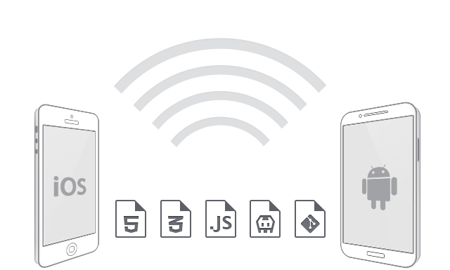

# Frameworks for Hybrid Apps

##### Table of Contents  
1. [Mobile apps](#mobile)  
2. [Knockout based App with Bootstrap](#knockout)  
3. [jQuery Mobile based App](#jQM)  
4. [Kendo UI Mobile based App](#kendoUI)  

This text is an addition to the German talk "Apache Cordova and Frameworks for hybrid Apps" from Johannes Hoppe. He will introduce Apache Cordova (in this case: Telerik AppBuilder, which bases on Cordova). The main talk concentrates on three different frontend-frameworks. All of them have strength an weaknesses. This talks does not aim to provide a comprehensive comparison, instead Johannes will show how it feels to code with them. In the end, we will have a working prototype which shows the current DWX session.

You can download this prototype directly from the main app stores
* Android: https://play.google.com/store/apps/details?id=com.telerik.DwxDemoApp
* Windows Phone: http://www.windowsphone.com/en-us/store/app/demo-app-zur-dwx/cd5c1536-5690-4dea-a068-f1e5cb951703
* iOS: still pending review!

(or just search for "DWX" in your store)


<a name="knockout"></a>
## 1. Mobile apps

 Usually a mobile app belongs to one of these tree groups:

1. Native apps
2. Mobile optimized Websites
3. Hybrid apps

**Native apps** are built for a specific platform with the official platform SDK. Its important to know the specific development languages: Objective-C for iOS, Java for Android and C# for Windows Phone. The are published and sold via the official app store. Usually App stores are the most profitable distribution channel for publishers. On the one hand a closed app system guarantees revenue, but on the other hand it's hard to target different operation systems since specialized developers are required. Due to that fact, for most apps only the two big players (iOS and Android) are targeted.

**Mobile optimized websites** are just normal server-side apps, built with any server-side technology that renders HTML. The biggest challenges are the styling (it must feel "native" and must fit the the device form factor) and the fact, that a mobile device can be go offline or struggle with a limited connectivity. On the one hand its hard to monetize such an app, but on the other hand its easier to target various platform with the same team of developers, that can be specialized to any server-side programming language and framework.

**Hybrid apps** try to close the gap between both worlds. They are written with web technologies (HTML, CSS & JavaScript) and do not require specialized knowledge about the targeted platform and its tools. Hybrid apps are shipped with a native executable that provides a browser engine for the web stack as well as an abstraction layer that allows access of native libraries. This abstraction layer is presented as an JavaScript API. The browser engine (and the general performance JavaScript) as well as the amount of abstraction make hybrid apps slower in comparison to native apps. Having that in mind, hybrid platforms offer a suitable way to build apps with open standards that can be published to the app stores!

The most common framework for hybrid apps is [Apache Cordova](http://en.wikipedia.org/wiki/Apache_Cordova). The framework was originally called [PhonGap](http://phonegap.com/) until Adobe made it open source. Now PhoneGap is the name of the most common open source distribution of Cordova with an own app directory. However, as an windows user it can be tricky to create an iOS app. PhoneGap requires you to own a Mac, since tools required for building iOS applications run only on the OS X operating system. To avoid all platform specific struggles, Johannes will show all examples in [AppBuilder](http://www.icenium.com/). It's available as a cloud-based IDE as well as an Visual Studio Extension. AppBuilder hides the usual problems and lets us concentrate on pure App-development. Let's go!

<a name="knockout"></a>
## 2. MVVM - Knockout based App with Bootstrap

The  [MVVM](http://addyosmani.com/resources/essentialjsdesignpatterns/book/#detailmvvm) pattern got a lot of popularity in the last time. A big majority of client-side JavaScript frameworks support it (eg. Knockout.js, AngularJS, Kendo UI or Ext JS). You might want to learn more about it in the [first](https://github.com/JohannesHoppe/DeveloperMediaDemo/blob/master/Documentation/01.%20Knockout%20Webinar.md) and [second Developer Media webinar](https://github.com/JohannesHoppe/DeveloperMediaDemo/blob/master/Documentation/02.%20Knockout%20Webinar.md).

The demo **"CordovaBootstrapKnockout"** utilizes jQuery for data retrieval and iterates through the retrieved data with the help of [Knockout](http://knockoutjs.com/). Knockout started the popularity of MVVM in the JavaScript world. Some people might consider it as a bit outdated, but it is easy to use and comes with just one file - so it's perfect for a short demo! 

Of course, a plain white HTML5 application won't have an attractive appearance. The front-end framework [Bootstrap](http://getbootstrap.com/) is generally a solid way to get a modern look. It ships with a set of CSS classes (like `container`, `glyphicon`, `alert`, `list-group` or `badge`)  that can be used to style our hybrid application. Themes, like the [Bootswatch Slate theme](http://bootswatch.com/slate/), create a flat mobile-like app appearance. Here is an example where both the Bootstrap CSS classes as well as the Knockout **HTML 5 data-attributes** (`data-bind` with `click`, `foreach` and `text`) are used to show a list of talks:

```html
<div id="index_template" class="container">
         
    <i class="glyphicon glyphicon-home" data-bind="click: $root.loadData"></i>
    <h2>DWX 2014</h2>

    <div class="list-group" data-bind="foreach: talks">
        <a class="list-group-item" data-bind="click: $root.showDetails">
            <span class="badge" data-bind="text: moment(start()).format('HH:mm')"></span>
            <!--ko text: title--><!--/ko-->
        </a>
    </div>   

    <p class="alert alert-info">
        Diese App verwendet <b>Knockout.js</b> und ist ein Beispiel für die Entwicklung von hybriden Anwendungen mit Apache Cordova.
    </p> 
</div>
``` 

Which renders to this screen in Apache Cordova / Icenium: 


Bootstrap comes with a lot of CSS tricks. For example a special font ("[glyphicons](http://glyphicons.com/)") is used to create scalable icons. Those iconfont contain icons instead of letters. A good font looks sharp on all devices, so that higher pixel ratios of "retina displays" do not have any negative impact. As a best practice, try to avoid pixel images in a mobile application. You might want to check [Font Awesome](http://fontawesome.com) and **[weloveiconfonts.com](http://weloveiconfonts.com/)** for more icon fonts. too.

<a name="jQM"></a>
## 3. jQuery Mobile based App

As we have seen, Bootstrap has "mobile first" responsive grid and a appealing flat graphical style. But it is still designed to work on mobile engines as well as in normal browsers. The demo **"CordovajQueryMobileDemo"** utilizes jQuery for data retrieval and renders its content with jQuery Mobile. JQuery mobile (often abbreviated as **jQM**) goes on step further and concentrates on mobile scenarios only. As the name suggests, it is a framework on top of jQuery. While Bootstrap does its (black) magic with CSS tricks, jQuery mobile is overcoming HTML5 limitations with JavaScript. For example a button is transformed from this:

```html
<button type="submit">Go</button>
```
to this:
```html
<div class="ui-btn ui-btn-inline ui-btn-corner-all ui-shadow ui-btn-up-c">
  <span class="ui-btn-inner ui-btn-corner-all">
    <span class="ui-btn-text">Go</span>
  </span>
  <input class="ui-btn-hidden" type="button" value="Go" />
</div>
```
On the one hand all these enhancement hide a lot of problems to the developer, on the other hand it is a bit trickier to enrich jQM apps with a MVVM framework, as [explained here](http://www.scottlogic.com/blog/2013/04/08/comparing-kendoui-and-knockout-with-a-bit-of-jquerymobile-on-the-side.html#dom). Due to that reason, it is wise to concentrate on jQuery core and jQuery plugins only.

jQM is touch-optimized, themable and ships with a larger collection of [widgets](http://api.jquerymobile.com/category/widgets/). In contrast to the "normal" jQuery way, jQuery mobile is not concentrating on particular DOM elements. It is seeing the page as a whole and enhances all found elements. jQuery Mobile automatically applies many markup enhancements as soon as it loads. These enhancements are applied based on jQuery Mobile's default settings, which are designed to work with common scenarios. Too hook into this process, [read more in the documentation about the `mobileinit` event](http://api.jquerymobile.com/global-config/). This transformation can be steered by **HTML5 data attributes** (eg. `data-role`). The following snipped will render a page with three areas (a header, a content and a footer area).

```html
<div data-role="page">
	<div data-role="header">
		<h1>Title</h1>
	</div>
		<div data-role="content">
			<p>Page content.</p>
		</div>
	
	<div data-role="footer">
		Page Footer
	</div>
</div>
``` 

This is the rendered result in Apache Cordova / Icenium:


We don't have to care about page transitions. By default, all local links get a click listener automatically. jQuery Mobile will automatically handle page requests in a single-page model, using Ajax when possible. As shown in the next example, if a link in a multi-page document points to an anchor (#page-details), the framework will look for a page wrapper with that id (id="page-details"). If it finds a page in the HTML document, it will bring the new page into view. 

Loading of content is straightforward. We can use JQuery core as usual, so that this snipped is the only self-written JavaScript required to show the start screen:
```html
<div id="page-home" data-role="page" >

    <div data-role="header" data-position="fixed">
        <h1>Home</h1>
    </div>

    <div data-role="content">
        <h1>jQuery Mobile</h1>
        <p>
            The following list was rendered with <b>jQM</b>, a framework on top of <b>jQuery</b>.
        </p>
    </div>
    <div class="nav">
        <ul id="home-listview" data-role="listview"></ul>   <!-- HERE  -->
    </div>
</div>
```

```js
(function ($) {

    $("#page-home").on('pagebeforeshow', function () {
        
        $.ajax({
            url: 'http://johanneshoppe.github.io/DeveloperMediaSlides/examples/webinarp.json',
            dataType: 'jsonp',
            jsonpCallback: 'callback'
        }).done(function (result) {
            $('#home-listview')
                .empty()
                .append(createListItems(result))
                .listview('refresh');
        });
    });

    var createListItems = function(data) {

        var items = [];
        $.each(data, function(index, item) {

            var listItemWithLink = $('<li />').append(
                $('<a />')
                    .attr('href', '#page-details')
                    .data('transition', 'slide')
                    .text(item.Title));

            items.push(listItemWithLink);
        });
        return items;
    };

})(window.jQuery);
```

As you see, we are inserting some `<li><a href="" /></li>` elements directly into the document. It is important to know, that the [Listview Widget](http://api.jquerymobile.com/listview/) requires a call at the **refresh** method to update the visual styling.

Here is the final result:


<a name="kendoUI"></a>
## 4. Kendo UI Mobile based App

In my opinion there is a golden mean between a pure CSS-based framework (like Bootstrap) combined with a MVVM framework (like Knockout) and jQuery mobile. This framework is called Kendo UI mobile. Kendo UI Mobile was definitely inspired by both Knockout AND jQuery mobile. It uses well-known HTML5 data attributes, like `data-bind="text: Text"` for MVVM **data-binding** as in Knockout and `data-role="listview"` for the creation of a **widget** as in jQM. Please take a look at the **"CordovaKendoUiMobileDemo"** sample app. 
    
But in contrast to jQM, with Kendo when you create a button:

```html
<a data-role="button">Go</a>
```
the enhanced HTML will be only changed to this:
```html
<a data-role="button" class="km-button">
	<span class="km-text">Go</span>
</a>
```
(...which is great!)

Unlike the jQuery mobile, the mobile version of Kendo UI is doing some hidden task under the hood.
Initializing a `kendo.mobile.Application` does the following:

1. Attaches event handlers for various events
2. Adds various CSS classes to page elements
3. Appends meta tags for the viewport configuration
4. Listens for browser history changes

Similar to the Bootstrap glyphicons, Kendo UI Mobile includes integrated [font icons](http://docs.kendoui.com/getting-started/mobile/icons), too. They can be applied by specifying the `data-icon` attribute on some widgets. All other elements can use the CSS classes directly. (eg. `class="km-icon km-featured"`)

The final source code looks like this and renders to the following screenshot.
Please notice that we can declare the required ViewModel directly in the source code. (`data-model="app.indexPageViewModel"`)  
```html
<div id="indexPage" data-role="view" data-title="Home" data-model="app.indexPageViewModel">

    <div data-role="content" class="view-content">
        
        <i class="km-icon km-home"></i>
        <h1>Kendo UI Mobile</h1>
        <p>
            The following list was rendered with <b>Kendo UI Mobile</b>,
            a MVVM framework on top of <b>jQuery</b>.
        </p>         
                    
        <ul data-role="listview"
            data-template="notesTemplate"
            data-style="inset"
            data-bind="source: notes, events: { click: showDetails }">
        </ul>   

    </div>
</div>   

<script id="notesTemplate" type="text/x-kendo-template">
    <a>#=Title#</a>
</script>
```

```js

(function (global) {
    var app = global.app = global.app || {};

    document.addEventListener("deviceready", function() {

        app.indexPageViewModel = new IndexPageViewModel();
        app.indexPageViewModel.loadData();
        app.application = new kendo.mobile.Application($(document.body), { layout: "tabstrip-layout" });

    }, false);

})(window);


var IndexPageViewModel = function () {

    var viewModel = kendo.observable({
        notes: [],

        loadData: function() {

            $.ajax({
                url: 'http://johanneshoppe.github.io/DeveloperMediaSlides/examples/webinarp.json',
                dataType: 'jsonp',
                jsonpCallback: 'callback'
            }).done(function(result) {
                viewModel.set("notes", result);
            });
        },

        showDetails: function(e) {
            app.detailsPageViewModel.setData(e.dataItem);
            app.application.navigate('#detailsPage', 'slide:left');
        }
    });

    return viewModel;
}
```


<hr>

_&copy; 2014, Johannes Hoppe_